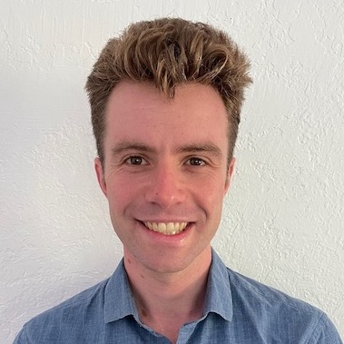

{.headshot}

# Sam Hopkins

#### [Home](index.html) [Publications](pubs.html)

*algorithms, theoretical machine learning, semidefinite programming, sum of squares optimization, convex hierarchies, bicycles. he/him.*

I am an Assistant Professor at MIT, in the [Theory of Computing](https://toc.csail.mit.edu/) group in the [Department of Electrical Engineering and Computer Science](https://www.eecs.mit.edu/). If you are interested in working with me as a PhD student, please [apply](https://www.eecs.mit.edu/academics-admissions/graduate-program/admissions) to MIT's EECS PhD program!

Previously, I was a [Miller](http://miller.berkeley.edu/) fellow in the [theory group](http://theory.cs.berkeley.edu/) at UC Berkeley, hosted by [Prasad Raghavendra](https://people.eecs.berkeley.edu/~prasad/) and [Luca Trevisan](https://lucatrevisan.github.io/). Before that, I got my PhD at [Cornell](https://www.cs.cornell.edu/research/theory), advised by [David Steurer](http://www.dsteurer.org/).

[CV (pdf)](cv.pdf) [Google Scholar](https://scholar.google.com/citations?user=E_a3VB4AAAAJ&hl=en) [YouTube](https://www.youtube.com/channel/UC0SsR6PPN3SuO7IzFc1Bhfg)

### Writings which are not papers, Videos

[Advice](fellowship_advice.html) on applying for fellowships.

[Advice](grad_advice.html) on PhD applications.

Blog posts I wrote on clustering and learning high-dimensional mixture models using the SoS method (originally appeared on [Windows on Theory](https://windowsontheory.org/). [pdf](clustering.pdf)

Notes on tensor decomposition using the SoS method (originally notes for a guest lecture at Stanford). [pdf](tensor-decomp-notes.pdf)

A short general-audience video about my research. [youtube](https://www.youtube.com/watch?v=wvdNs4keEys)

Slides from a high-level introduction to SoS for cryptographers, from this [workshop](https://crypto.iacr.org/2019/affevents/nrc/page.html). [slides (pptx)](crypto-2019-talk.pptx)

### Service

PC Member: RANDOM 2020, ITCS 2021, STOC 2022

### Notes

I have been supported by a Simons Postdoctoral Fellowship and a Miller Postdoctoral Fellowship, both at UC Berkeley. As a PhD student, I received support from a  Microsoft PhD Fellowship, an NSF Graduate Research Fellowship, and a Cornell University Fellowship.

I am Samuel B. Hopkins. Maybe you are looking for [Samuel Francis Hopkins](http://www-users.math.umn.edu/~shopkins/)?

### Not Math

[Where](restaurants.html) to eat in Berkeley or Ithaca

[I](pics/tongue.jpg) [like](pics/mtdiablo.jpg) [bikes](pics/snow.jpg).

### Contact
Office: G666, Stata Center (Building 32), MIT\
*samhop at mit.edu*
