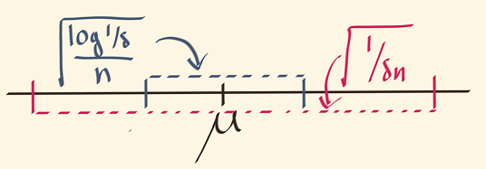
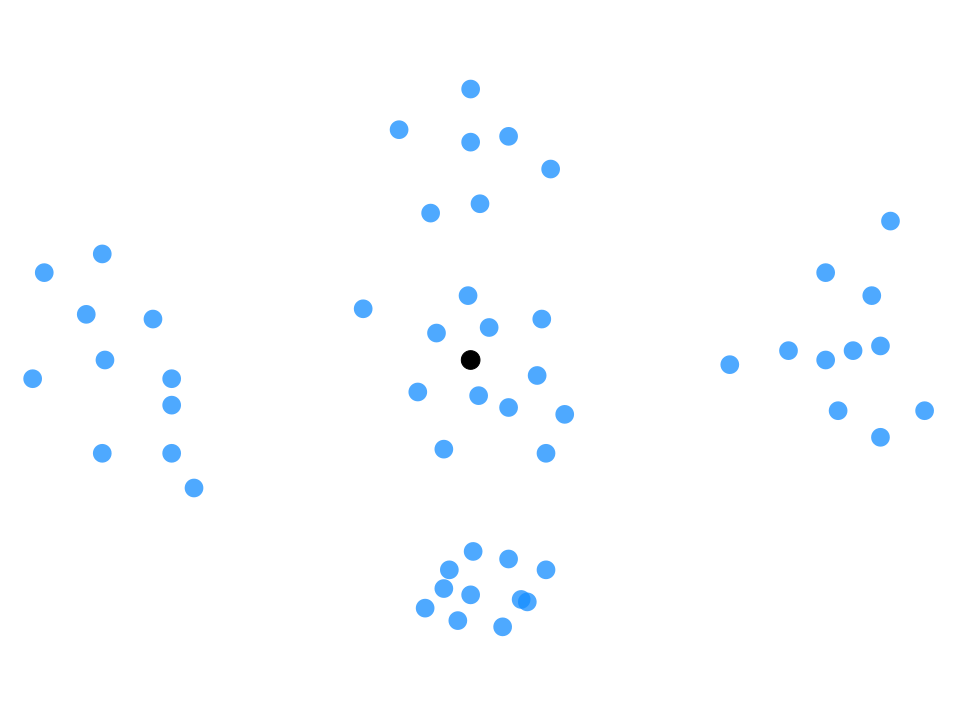
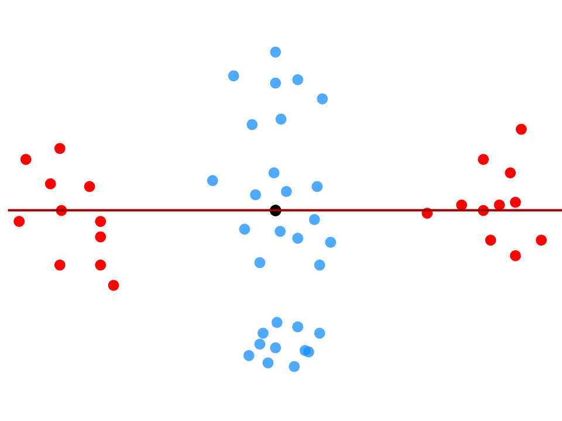
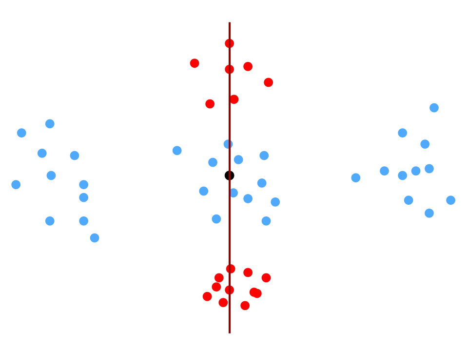
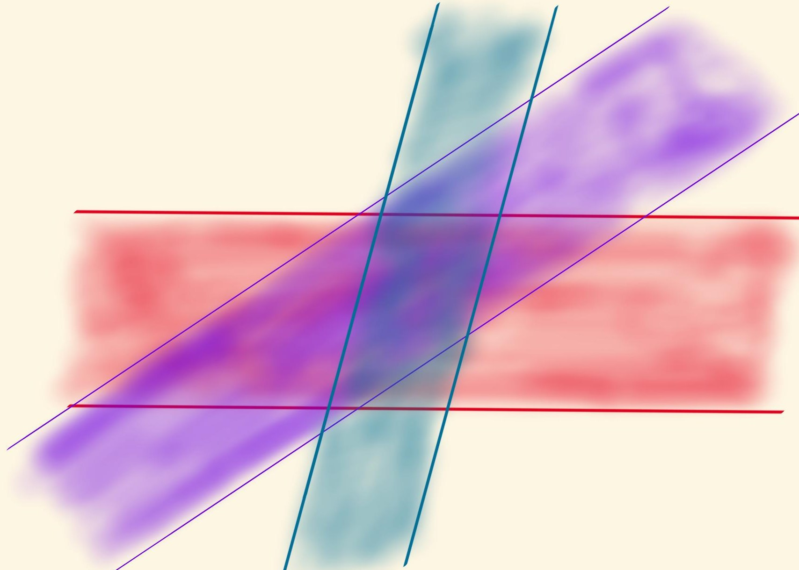
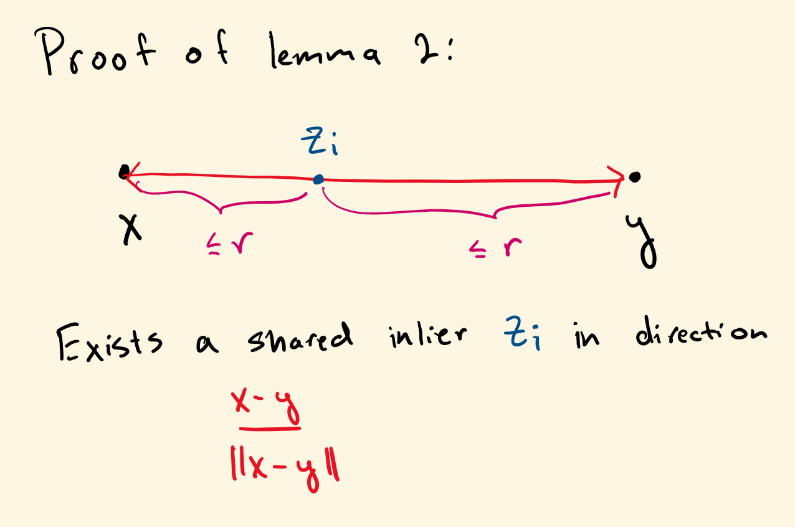
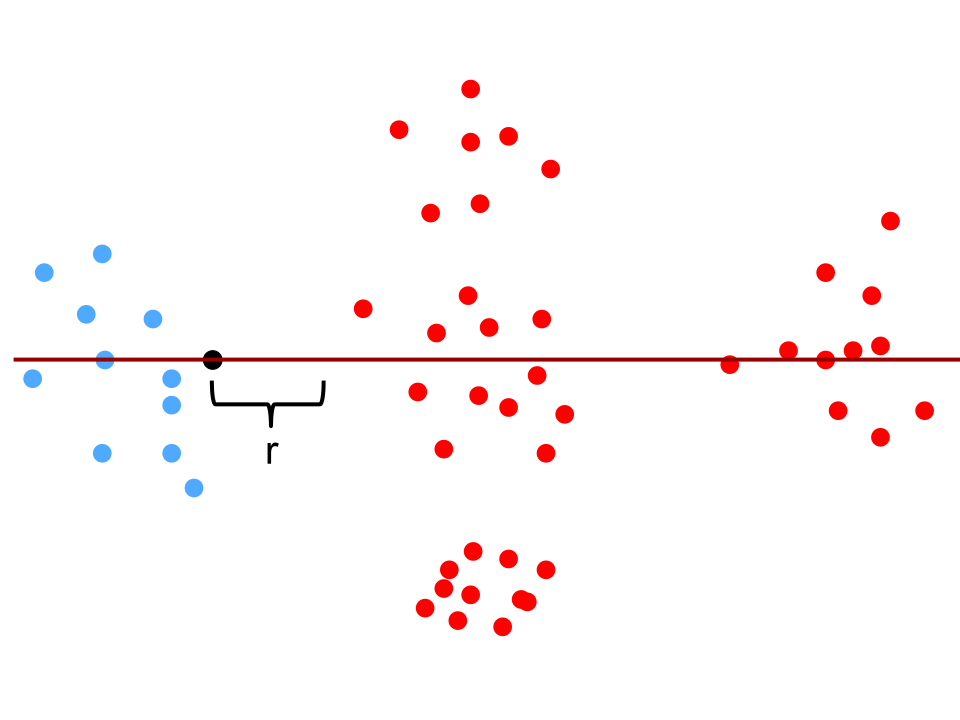
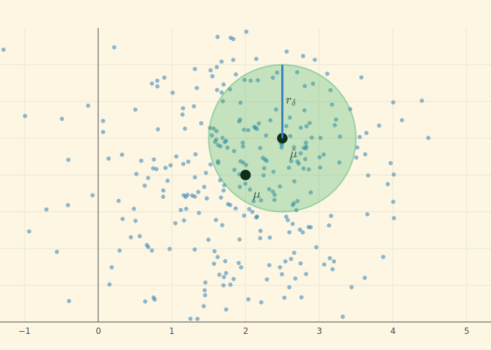

(loading loading loading -- advance slide)

$\newcommand{\R}{\mathbb{R}}$
$\newcommand{\e}{\varepsilon}$
$\newcommand{\cD}{\mathcal{D}}$
$\newcommand{\poly}{\text{poly}}$
$\newcommand{\cN}{\mathcal{N}}$
$\newcommand{\tensor}{\otimes}$
$\newcommand{\E}{\mathop{\mathbb{E}}}$
$\renewcommand{\hat}{\widehat}$
$\newcommand{\iprod}[1]{\langle #1 \rangle}$
$\newcommand{\pE}{\tilde{\mathbb{E}}}$
$\newcommand{\Paren}[1]{\left ( #1 \right )}$
$\newcommand{\N}{\mathbb{N}}$
$\newcommand{\Tr}{\text{Tr}}$

---

# mean estimation with sub-gaussian rates in polynomial time

[**sam hopkins (miller fellow, uc berkeley)**]{.center .blue}

---

## estimating the mean of a random vector

>**observe:** $X_1,\ldots,X_n \in \R^d$ independent copies of $X$\
>**goal:** estimate $\mu = \E X$
>

. . .

\

\

assume **isotropic:** [$\E (X - \mu)(X - \mu)^\top = I$]{.blue} (this talk)

. . .

\

\

**goal:** [strong nonasymptotic guarantees,]{.magenta} [weak assumptions on $X$,]{.blue .fragment} [polynomial time]{.red .fragment}

---

## estimating the mean of a random vector

>**observe:** $X_1,\ldots,X_n \in \R^d$ independent copies of $X$\
>**goal:** estimate $\mu = \E X$
>

*empirical mean:* [$\overline{\mu} = \tfrac 1 n \sum X_i$]{.blue}

*mean square error:* $\E \| \overline{\mu} - \mu \|^2 = \frac 1 n \E \|X - \mu\|^2 = \frac d n$

. . .

what about *confidence intervals? (c.i.)* i.e. $\Pr( \| \overline{\mu} - \mu \| > t )$?

$\Pr(| \overline{\mu} - \mu | > t) \leq \delta$ implies $\delta$-c.i. of width $t$

---

## nonasymptotics for the empirical mean

first, $d=1$. [how small is $\Pr(| \overline{\mu} - \mu | > t)$?]{.magenta}

. . .

. . .

$$\underbrace{X \sim \cN(\mu,1)}_{\text{strong (gaussian) assumption}} \Rightarrow \underbrace{\Pr( |\overline{\mu} - \mu| > t ) \leq \exp(-t^2 n)}_{\text{thin (gaussian) tail}}$$

$$\underbrace{X \text{ has } \E (X - \mu)^2 \leq 1}_{\text{weak (2nd moment) assumption}} \Rightarrow \underbrace{\Pr (| \overline{\mu} - \mu| > t) \leq \frac 1 {t^2 n}}_{\text{fat tail}}$$

. . .

[]{.center}

---

## heavy tails

only assume $\E X, \E X^2$ are finite.

<iframe allowtransparenncy="true" width="800" height="400" src="gaussian_pdf.html" frameborder="0"></iframe>

data could be [gaussian]{.blue}

but it could be [corrupted]{.green}, [heavy-tailed]{.orange}, or [maybe you just don't know]{.red}

---

## beyond the empirical mean ($d=1$)

recall: i.i.d. samples $X_1,\ldots,X_n$ of $X$, try to estimate $\mu = \E X$

[**how confident can you be?**]{.magenta} [is there an estimator $\hat{\mu}$ with $\Pr( |\hat{\mu} - \mu| > t ) \leq \exp(-\Omega(t^2 n))$ when $X$ is heavy-tailed?]{.fragment}

. . .

no. [**but you can fake it!**]{.fragment .red}

. . .

**theorem (old):**

for every $t$, exists $\hat{\mu}_t$ such that $\Pr( | \hat{\mu}_t - \mu | > t ) \leq \exp(-\Omega(t^2 n))$

and $\hat{\mu}_t$ is poly-time computable

. . .

[**can estimate $\mu$ as if $X$ were Gaussian, even if only $\E X, \E X^2$ exist**]{.magenta .center}

. . .

[**what happens for $d > 1$?**]{.red .center}

---

## tail of the empirical mean, high dimensions

same story, now with added curse of dimensionality

. . .

**gaussian case:**

$X \sim \cN(\mu, I) \Rightarrow \Pr( \|\overline{\mu} - \mu\| > t + \underbrace{\sqrt{d/n}}_{\approx \E \|\overline{\mu} - \mu \| } ) \leq \underbrace{\exp(-t^2 n)}_{d\text{-independent subgaussian tail}}$

. . .

**heavy-tailed case:**

covariance $I \Rightarrow \Pr( \|\overline{\mu} - \mu\| > t ) \leq \underbrace{\frac d {t^2 n}}_{d\text{-dependent fat tail}}$

---

## beyond the empirical mean, high dimensions

$X \sim \cN(\mu, I) \Rightarrow \Pr( \|\overline{\mu} - \mu\| > t + \underbrace{\sqrt{d/n}}_{\approx \E \|\overline{\mu} - \mu \| } ) \leq \underbrace{\exp(-t^2 n)}_{d\text{-independent subgaussian tail}}$

. . .

**theorem (lugosi-mendelson, 2018):**

for every $t$, exists $\hat{\mu}_t$ such that

$$\Pr \left ( \| \hat{\mu}_t - \mu \| > O \left (t + \sqrt{d/n} \right )  \right )\leq \exp(-t^2 n)$$

assuming only $\E(X-\mu)(X-\mu)^\top = I$.

[new **combinatorial** notion of **high-dimensional median**]{.fragment}[, appears to require $\exp(d)$ time]{.fragment}

. . .

[**theorem (this work):** same, but $\hat{\mu}_t$ is **computable in time $O(dn) + (dt)^{O(1)}$**]{.magenta}

---

## prior work

covariance $I$, $n$ samples

. . .

(disclaimer: "tail" not strictly accurate because one estimator $\hat{\mu}_t$ for each $t$)

. . .

\

estimator                dim.                     tail                     time                  ref.
---------                ---------                ----------               ----                  ---------
empirical mean           any                      $d/t^2 n$                 poly                  folklore
(many)                   $1$                      $\exp(-t^2 n)$            poly                  (many)
geometric median         any                      $\exp(-t^2 n /d)$         poly                  [[Minsker 13, Hsu-Sabato 13]]{.small}
tournament median        any                      $\exp(-t^2 n)$            exp                   [[Lugosi-Mendelson 18]]{.small}
**median-sdp**           **any**                  **$\exp(-t^2 n)$**        **poly**              **this work**

---

## main theorem

>**theorem:**  given $X_1,\ldots,X_n,\delta$, can find $\hat{\mu}$ such that
>
>$$
\Pr \left ( \left \| \hat{\mu} - \mu \right \| > C \left ( \sqrt{\frac{d}{n}} + \sqrt{\frac{\log(1/\delta)}{n}} \right ) \right ) \leq \delta \, ,
$$
>
>in time $O(nd) + (d \log(1/\delta))^{O(1)}$

. . .

\

**main innovation:** new semidefinite programming (sdp) algorithm for high-dimensional median, based on sum of squares method (sos).

[**sos familiarity is not a prerequisite for this talk.**]{.magenta}

---

## agenda

\
\
\
\

1. the $d=1$ case: median of means
2. lugosi and mendelson's median
3. median-sdp

---

## median of means in one dimension

[[nemirovsky-yudin, jerrum-valiant-vazirani, alon-matias-szegedy]]{.cite}

\

$X_1,\ldots,X_n$ i.i.d. copies of $X$ with $\E X = \mu$ and $\E (X - \mu)^2 = 1$

**goal:** construct $\hat{\mu}_\delta$ with

$$
\Pr \Paren{\|\mu - \hat{\mu}_\delta \|  \gg  \sqrt{\frac{\log(1/\delta)}{n}} } \leq \delta
$$

---

---

[]{.fragment}\
[]{.fragment}\
[]{.fragment}

---

\
\
\
\
\

**key insight: *number of outliers* concentrates even when *sum of outliers* does not.**

---

## analysis

\

\

$Z_1,\ldots,Z_{\log(1/\delta)}$ are bucketed averages, $\E Z = \mu$ and $\E(Z - \mu)^2 = \tfrac {\log(1/\delta)} n$

. . .

$\Pr(|Z_i - \mu| \gg \sqrt{\log(1/\delta)/n}) \leq 0.01$ [by Chebyshev]{.magenta}

. . .

$2/3$ of $Z_i$'s have $|Z_i - \mu| \ll \sqrt{\log(1/\delta)/n}$ w.p. $1-2^{-\log(1/\delta)} = 1-\delta$ [by Chernoff]{.magenta}

. . .

$|\text{median}\{Z_i\} - \mu| \ll \sqrt{\log(1/\delta)/n}$ w.p. $1-\delta$.

---

## median of means in higher dimensions -- first attempt

**recall gaussian case:**

$X \sim \cN(\mu, I) \Rightarrow \Pr( \|\overline{\mu} - \mu\| > t + \sqrt{d/n} ) \leq \exp(-t^2 n)$

i.e. $\delta$-c.i. radius $O\Paren{\sqrt{\frac dn} + \sqrt{\frac {\log 1/\delta} n}}$

. . .

**goal:** match this, only assume $\E (X - \mu)(X - \mu) = I$

---

[]{.center}

---

## median of means in higher dimensions -- first attempt

**recall gaussian case:**

$X \sim \cN(\mu, I) \Rightarrow \Pr( \|\overline{\mu} - \mu\| > t + \sqrt{d/n} ) \leq \exp(-t^2 n)$

i.e. $\delta$-c.i. radius $O\Paren{\sqrt{\frac dn} + \sqrt{\frac {\log 1/\delta} n}}$

**goal:** match this, only assume $\E (X - \mu)(X - \mu) = I$

**problem:** can have $\|Z_i - \mu\| \approx \sqrt{\log(1/\delta) d/n}$ for most $Z_i$

. . .

[result: **dimension-dependent** tail $\exp(-t^2 n / d)$]{.red}

[i.e. $\delta$-c.i. radius $O\Paren{\sqrt{\frac{ d \log(1/\delta)}{n}}}$]{.red .fragment}

---

## lugosi and mendelson's median

. . .

[cannot ask for $2/3$ of $Z_i$'s to be non-outliers]{.magenta}

. . .

[instead, ask for every direction to have at most $1/3$ outliers!]{.magenta}

---

---

---

---

## lugosi and mendelson's estimator

**input:** $X_1,\ldots,X_n,\delta$

. . .

**buckets:** bucketed means $Z_1,\ldots,Z_k$ for $k = \log(1/\delta)$

. . .

**centrality:** $x$ is $r$-central if in all directions $u$, for at least $2/3$ of $Z_i$,

$|\iprod{Z_i,u}  - \iprod{x,u}| \leq r$

. . .

[**implication:** $x$ is $r$-central implies $x$ has dist. at most $r$ to a median in every direction]{.cyan}

---

---

## lemmas for lugosi-mendelson estimator

remember: $X_1,\ldots,X_n$ samples in $k = \Theta( \log(1/\delta))$ buckets, $Z_i$ is mean in $i$-th bucket.

\

[**lemma 1:** If $r \gg \sqrt{d / n} + \sqrt{\log(1/\delta) / n}$ then w.p. $1-\delta$, $\mu$ is $r$-central]{.blue}

\

[**lemma 2:** any two $r$-central $x,y$ also have $\|x - y\| \leq 2r$]{.fragment .magenta}

---

---

## lemmas for lugosi-mendelson estimator

remember: $X_1,\ldots,X_n$ samples in $\log(1/\delta)$ buckets, $Z_i$ is mean in $i$-th bucket.

\

[**lemma 1:** If $r \gg \sqrt{d / n} + \sqrt{\log(1/\delta) / n}$ then w.p. $1-\delta$, $\mu$ is $r$-central]{.blue}

\

[**lemma 2:** any two $r$-central $x,y$ also have $\|x - y\| \leq 2r$]{.magenta}

\

. . .

**algorithm:** output any $r$-central $x$

. . .

\

[**running time????**]{.red}

---

## median sdp

(almost) a convex (sdp) relaxation of the set of $r$-central $x$'s

. . .

with enough constraints that [each step of the lugosi-mendelson analysis also applies to the sdp]{.magenta} (the heart of the "proofs to algorithms" SoS method)

. . .

**$\text{poly}(d,\log(1/\delta))$ constraints enough to capture all important properties of integral solutions.**

---

[$$
\{ x \, : \, \text{ for all $u$, at most $1/3$ of the $Z_i$'s have $|\iprod{Z_i,u} - \iprod{x,u}| > r$} \}
$$]{.blue}

[how would you know if you found a central $x$?]{.magenta .center}

\

[**algorithmic lemma 1:** if $r \gg \sqrt{d / n} + \sqrt{\log(1/\delta) / n}$ w.p. $1-\delta$ there is a *certificate* $M_\mu$]{.fragment}

[which *proves* that for every unit vector $u \in \R^d$]{.fragment}

[exist at most $1/3$ of the $Z_i$'s s.t. $|\iprod{Z_i, u} - \iprod{\mu,u}| > r$.]{.fragment}

\

[**algorithmic lemma 2:** there is a polynomial-time algorithm which finds $x$ such that $\|x - y\| \leq 2r$ if $y$ has a certificate $M_y$.]{.fragment}

. . .

\

[$$
\{ (x,M_x) \, : \, \text{ $M_x$ proves for all $u$, at most $1/3$ of the $Z_i$'s have $|\iprod{Z_i,u} - \iprod{x,u}| > r$} \}
$$]{.blue}

---

## certifying centrality

**change of notation:** $Z$ has mean $\mu$ and covariance $I$ ($X$ has disappeared)

(if $Z_1,\ldots,Z_k$ are bucketed means of $X_1,\ldots,X_n$ and $k = \log(1/\delta)$, recover previous setting.)

>**problem:** given $Z_1,\ldots,Z_k,r$ [*and* $x$]{.magenta}, [certify]{.blue} that for all unit $u$, at most $k/3$ $Z_i$'s have $\iprod{Z_i,u} - \iprod{x,u} > r$.

. . .

[**what is certification?**]{.blue}

. . .

[algorithm takes $Z_1,\ldots,Z_k,r,x$, outputs "yes" or "I don't know"]{.blue}

. . .

[output is yes $\rightarrow$ $x$ is $r$-central]{.blue}

. . .

**goal:** certification succeeds w.p. at least $1 - \exp(-k/10)$ when $r  \gg \sqrt{d / k} + 1$ [*and $x = \mu$*]{.magenta}

---

---

## the centrality sdp

start with a quadratic program in $b = b_1,\ldots,b_k, u = u_1,\ldots,u_d$:

$$\max_{u,b} \sum b_i \text{ such that } b_i^2 = b_i, \|u\|^2 = 1, \text{ and } b_i \iprod{Z_i,u} \geq b_i (\iprod{x,u} + r)$$

. . .

\

[relax $(b,u)(b,u)^\top$ to block PSD matrix]{.magenta .center}

[$$\left ( \begin{array}{cc} B & W \\ W^\top & U \end{array} \right ) $$]{.magenta}

. . .

\

[
\begin{align}
SDP(Z_1,\ldots,Z_k,\mu)  = & \max \, \text{Tr} B \text{ such that} \\
& B_{ii} \leq 1 \\
& \Tr U = 1 \\
& \iprod{Z_i, W_i} \geq \iprod{x, W_i} + r B_{ii}
\end{align}
]{.blue .center}

---

## glimpse of the analysis

**goal:** if $r \gg \sqrt{d / k} + 1$ then w.p. $1-e^{-k/10}$,

$$SDP(Z_1,\ldots Z_k, \mu) \leq k/3$$

[then **dual solution** is a (degree $2$ sos) proof $M_\mu$]{.fragment .red}

\

. . .

[**expectation:** $\E SDP(Z_1,\ldots,Z_k,\mu) \leq k/6$]{.blue}

[*proof step 1:* relate $SDP(Z_1,\ldots,Z_k,\mu)$ to $2 \rightarrow 1$ norm of a random matrix]{.blue}

. . .

[*proof step 2:* Grothendieck's inequality for sdp approximation of $2 \rightarrow 1$ norm]{.blue}

\

. . .

[**concentration:** $\Pr ( SDP(Z_1,\ldots,Z_k,\mu) - \E SDP(Z_1,\ldots,Z_k,\mu) > k/6 ) < e^{-k/10}$]{.magenta}

[*proof sketch:* $SDP(Z_1,\ldots,Z_k,\mu)$ satisfies a **bounded differences** property -- pays at most $1$ per outlier.]{.magenta}

---

## proof insights

[**sdp and robust matrix norms:**]{.center}

usual norms of $Z_1,\ldots,Z_k$ sdps are bad, e.g. $\left \| \sum_{i =1}^k Z_i Z_i^\top \right \| = \|(Z_1,\ldots,Z_k)^\top\|_{2 \rightarrow 2}^2$

sdps can handle less outlier-sensitive norms, e.g. $\| (Z_1,\ldots,Z_k)^\top \|_{2 \rightarrow 1}$

. . .

\
\

[**sdps and stability:**]{.center}

unlike norms and averages, sdp can move by $ \leq 1$ even if $Z_i$ moves by $10^{10}$.

sdps can concentrate better than norms and averages

---

**algorithmic lemma 1:** If $r \gg \sqrt{d / n} + \sqrt{\log(1/\delta) / n}$ w.p. $1-\delta$ there is a *certificate* $M_\mu$

which *proves* that for every unit vector $u \in \R^d$

exist at most $k/3$ $Z_i$'s s.t. $|\iprod{Z_i,u} - \iprod{\mu,u}| > r$

\

[**algorithmic lemma 2:** there is a polynomial-time algorithm which finds $x$ such that $\|x - y\| \leq 2r$ if $y$ has a certificate $M_y$.]{.fragment}

\

[prove in degree 8 SoS that $(x,M_x), (y,M_y)$ must have $\|x-y\| \leq 2r$, get an algorithm for free.]{.blue .fragment}

[**or, use gradient descent!** [Cherapanamjeri, Flammarion, Bartlett '19]]{.red .fragment}

---

## conclusion

**main theorem:** first polynomial-time estimator for heavy-tailed estimation [matching empirical mean's performance in Gaussian setting]{.magenta}

. . .

[&#127798; &#127798; **news:**]{.red} running time already improved to $(\text{input size})^4$ by Cherapanamjeri, Flammarion, Bartlett  -- **how low can you go?**

. . .

[&#127798; &#127798; &#127798; **news:**]{.red} running time already improved to $(\text{input size})^2$ by Depersin, Lecue -- **how low can you go???**

. . .

[&#127798; &#127798; &#127798; &#127798; **news**:]{.red} new paper with Cherapanamjeri, Kathuria, Raghavendra, Tripuraneni with improved *but not optimal* results for linear regression and covariance estimation. **can you get optimal rates in poly time?**

. . .

**practical consequences?:** is there a *practical algorithm* whose *empirical* performance improves on state-of-the-art for heavy-tailed estimation?

. . .

\

[**thanks!**]{.center}

---

## Confidence Intervals

---

## Confidence Intervals / Non-Asymptotics: Gaussians

If $X_1,\ldots,X_n \sim \cN(\mu, \Sigma)$ then [$\overline{\mu} = \frac 1 n \sum_{i=1}^n X_i \sim \cN(\mu, \Sigma / n)$]{.blue}

. . .

$\delta$ confidence interval radius: [$\sqrt{\frac{\Tr \Sigma}{n}} + \sqrt{\frac{2 \|\Sigma\| \log(1/\delta)}{n}}$]{.blue}

. . .

\

[**Consider $\Sigma = I, \mu = 0$**]{.center}

. . .

$\overline{\mu} \sim \cN(0, I/n)$, so $\|\overline{\mu}\|^2 = \sum_{i=1}^d g_i^2 \approx \frac{d \pm \sqrt{d \log (1/\delta)}}{n}$ [**norm of std. Gaus.**]{.red}

\

. . .

[$\|\overline{\mu}\| = \sqrt{\sum_{i=1}^d g_i^2} \approx \sqrt{\frac d n } \cdot \Paren{1 \pm \frac {\sqrt{\log 1/\delta}} {\sqrt d}} = \sqrt{\frac dn} + \sqrt{\frac{1 \cdot \log(1/\delta)}{n}}$]{.magenta}

---

## Heavy Tails

Only assume $\mu = \E X$ and $\Sigma = \E(X - \mu)(X - \mu)^\top$ are finite.

<iframe allowtransparenncy="true" width="800" height="400" src="gaussian_pdf.html" frameborder="0"></iframe>

Heavy tails do occur in high dimensions: corruptions, power laws in large networks, etc.

---

## Heavy Tails and the Empirical Mean

[$\Tr \Sigma = \E \|X - \mu\|^2$ and $\|\Sigma\|=$ magnitude of principal component.]{.center}

. . .

[**Sub-Gaussian $X$**]{.center}

$$r_\delta = \sqrt{\frac{\Tr \Sigma}{n}} + \sqrt{\frac{2 \|\Sigma\| \log(1/\delta)}{n}}$$

. . .

[[$1/\sqrt{n}$ rate]{.cyan}, [$\sqrt{\log 1/\delta}$ tail bound,]{.fragment .blue} [$\sqrt{\log 1/\delta}$ multiplies $\sqrt{\|\Sigma\|}$]{.fragment .magenta}]{.center}

. . .

[**Heavy-tailed $X$**]{.center}

$$ r_\delta = \sqrt{\frac{\Tr \Sigma}{n \delta}} $$

. . .

[$1/\sqrt{n}$ rate]{.cyan}\
[$\sqrt{1/\delta}$ tail bound [**crisis of confidence**]{.right}]{.fragment .blue}\
[$\sqrt{1/\delta}$ multiplies $\sqrt{\Tr \Sigma}$ [**curse of dimensionality**]{.right}]{.fragment .magenta}

---

For which r.v.'s $X$ can $\E X$ be estimated with [**sub-Gaussian-like confidence intervals**]{.blue}?

. . .

[[**Only need bounded 2nd moments!**]{.red} [[Lugosi-Mendelson 18]]{.grey} ]{.center}

. . .

[But if $X \in \R^d$, it takes $\exp(d)$ time to compute]{.center}

. . .

\
\

For which r.v.'s $X$ is there a [**polynomial-time computable**]{.magenta} and [**sub-Gaussian**]{.blue} estimator?

. . .

[**This work: only need bounded 2nd moments!**]{.center .red}

---

## Main Theorem

>**Theorem:**  Given $X_1,\ldots,X_n,\delta$, can find $\hat{\mu}$ such that
>
>$$
\Pr \left \{ \left \| \hat{\mu} - \mu \right \| > C \left ( \sqrt{\frac{\Tr \Sigma}{n}} + \sqrt{\frac{\|\Sigma\| \log(1/\delta)}{n}} \right ) \right \} \leq \delta \, .
$$
>
>in time $O(nd) + (d \log(1/\delta))^{O(1)}$.

. . .

\
\
