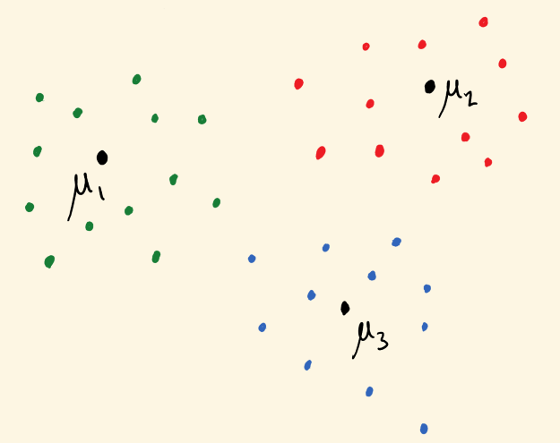
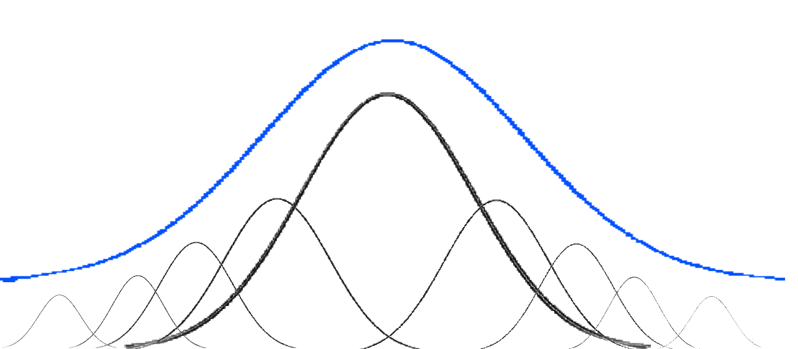
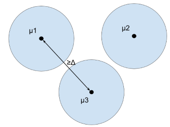
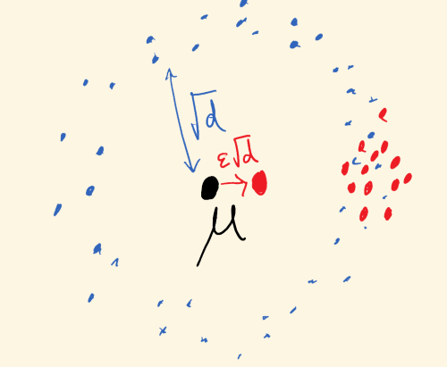
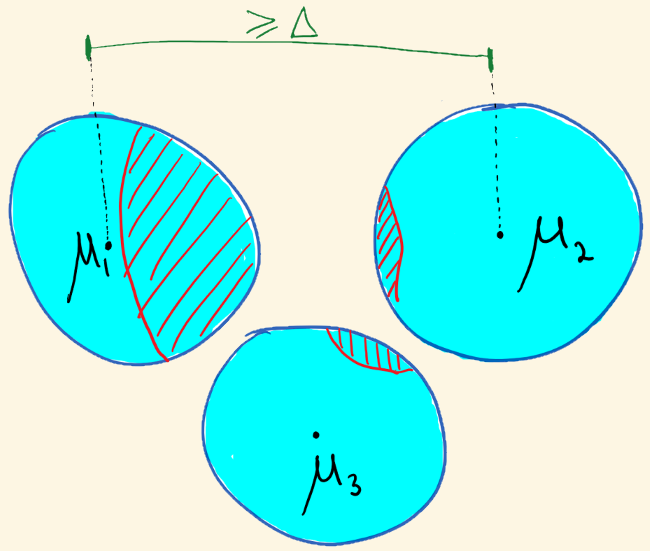

(loading loading loading -- advance slide)

$\newcommand{\P}{\mathbb{P}}$
$\newcommand{\R}{\mathbb{R}}$
$\newcommand{\e}{\varepsilon}$
$\newcommand{\cD}{\mathcal{D}}$
$\newcommand{\poly}{\text{poly}}$
$\newcommand{\cN}{\mathcal{N}}$
$\newcommand{\tensor}{\otimes}$
$\newcommand{\E}{\mathop{\mathbb{E}}}$
$\renewcommand{\hat}{\widehat}$
$\newcommand{\iprod}[1]{\langle #1 \rangle}$
$\newcommand{\pE}{\tilde{\mathbb{E}}}$
$\newcommand{\Paren}[1]{\left ( #1 \right )}$

---

# SoS and Robust Statistics, Part 2

[Sam Hopkins (Cornell University $\rightarrow$ UC Berkeley)]{.center .blue}

**Agenda:**

1. Wrap up from yesterday
2. Mixture models and clustering
3. Which distributions does SoS robustly estimate and cluster?

---

### Recap of Part 1

. . .

**SoS is [r]{.magenta}[e]{.blue}[a]{.magenta}[l]{.blue}[l]{.magenta}[y]{.blue} [g]{.magenta}[r]{.blue}[e]{.magenta}[a]{.blue}[t]{.magenta}** (Thor's hammer, Sauron's ring, etc.)

. . .

Offers a method to design *efficient algorithms* based on *simple identifiability proofs*.

. . .

>The "usual" identifiability argument for **mean estimation** with $\e$-corrupted samples under **bounded covariance assumptions** with **$O(\sqrt \e)$ error** is the right kind of simple.\
>[Uses only Cauchy-Schwarz, triangle inequalities, hence has an SoS certificate]{.magenta .fragment}

. . .

**The holy trinity:** [simple identifiability proofs]{.blue}, [sum-of-squares polynomials]{.magenta}, [efficient algorithms]{.cyan}

---

Yesterday we saw:

If $X = \{x_1,\ldots,x_m\}$ are $\e$-corrupted from a distribution $\cD$ with mean $\mu$, variance $1$, whp there are degree $O(1)$ polynomials $s_i(w,X',g), q_j(w,X',g)$ such that

[$O(\e) - (\mu - \mu)^2 = \sum s_i^2 + \sum q_j p_j$]{.blue}

. . .

where $p_1=0,\ldots,p_m=0$ enforce

[$w_i^2 = w_i$ and $\sum w_i = (1-\e)m$]{.magenta}

[$w_i(X_i - X_i')$]{.magenta}

[$\mu = \frac 1 {(1-\e)m} \sum w_i X_i'$]{.magenta}

[$\sum w_i(X_i - \mu)^2 + g^2 =1$]{.magenta}

**This is an SoS identifiability proof**

---

Not going to go through the basic identifiability proof yet again, but just a taste:

To *SoS-ify* the Cauchy-Schwarz step, use that

. . .

$\Paren{\sum_{i \leq n} y_i^2}\Paren{\sum_{i \leq n} x_i^2} -  \Paren{\sum_{i \leq n} x_i y_i}^2 = \sum_{i,j} (x_iy_j - x_j y_i)^2$

---

SoS identifiability proof + meta-theorem $\rightarrow$ efficient algorithm

>If $p_1(\hat{\Theta},W)=0,\ldots,p_m(\hat{\Theta},W)=0$ imply $\|\Theta - \hat{\Theta}\|^2 \leq \delta$ and this has an SoS proof of degree $t$, then there is an $(mn)^{O(t)}$ time algorithm to output $\Theta'$ with $\|\Theta' - \Theta\|^2 \leq \delta$.\
[$\delta - \|\Theta - \hat{\Theta}\|^2 = \sum s_i^2 + \sum q_j p_j$]{.blue .center .fragment}

. . .

**Proof of meta-theorem:**

. . .

Suppose linear operator $\pE \, : \, \R[\hat{\Theta},W]_{\leq t} \rightarrow \R$ such that

1. $\pE 1 = 1$
2. $\pE p^2 \geq 0$ for all $p$ such that $\deg p^2 \leq t$
3. $\pE p_i q = 0$ for all $q, p_i$ such that $\deg p_i q \leq t$

. . .

[Then $\pE \|\Theta - \hat{\Theta}\|^2 \leq \delta$, expands to $\|\Theta\|^2 + \pE \|\hat{\Theta}\|^2 - 2 \iprod{\Theta,\pE \hat{\Theta}} \leq \delta$.]{.blue}

. . .

[Since $\pE \|\hat{\Theta}\|^2 \geq \|\pE \hat{\Theta}\|^2$, we find $\|\pE \hat{\Theta} - \Theta\|^2 \leq \delta$.]{.blue}

---

Have some $p_1(y),\ldots,p_m(y)$

Suppose linear operator $\pE \, : \, \R[y]_{\leq t} \rightarrow \R$ such that

1. $\pE 1 = 1$
2. $\pE p^2 \geq 0$ for all $p$ such that $\deg p^2 \leq t$
3. $\pE p_i q = 0$ for all $q, p_i$ such that $\deg p_i q \leq t$

. . .

Set of such $\pE$ is feasible set of following SDP:

. . .

**Variables:** "$\pE y^\alpha$" for every multi-index $\alpha$ with $|\alpha| \leq t$ (assume $t$ even)

. . .

**They define an operator:** $\pE p(y) = \pE \sum p_\alpha y^\alpha = \sum p_\alpha \pE y^\alpha$

. . .

**Constraints (1) and (3):** $\pE 1 = \pE y^{\emptyset} = 1$ is a linear constraint. So is $\pE p_i(y) \cdot y^\alpha = 0$.

. . .

**Constraint (2):** $\pE p^2 \geq 0$ is equivalent to $p^\top M p \geq 0$ where $M_{\alpha,\beta} = \pE y^\alpha y^\beta$.

. . .

[Resulting SDP has "intended solution" $(y^{\tensor t/2})(y^{\tensor t/2})^\top$]{.magenta}\
[(compare with $yy^\top$ from basic SDP)]{.blue}

---

Final comments:

Run through the whole construction for robust mean estimation and will get an SDP with "intended solution"

$w^{\tensor t} \tensor \mu^{\tensor t} \tensor X^{\tensor t} \tensor g^{\tensor t}$

where $w$ is $0/1$ indicator of a set of $(1-\e)m$ samples with mean $\mu$, bounded covariance, and $X,g$ are auxiliary variables.

---

### Mixture Models

---

### Mixture Models

**Input:** Samples $X_1,\ldots,X_n \in \R^d$ from mixture of $\cD_1,\ldots,\cD_k$ with means $\mu_1,\ldots,\mu_k \in \R^d$

**Goal:** cluster $X_1,\ldots,X_n$ and/or estimate $\mu_1,\ldots,\mu_k$\

. . .

[**1890s:** Pearson *invents method of moments* to learn mixture of $k=2$ Gaussians in $d=1$ dimension]{.blue}

[**Now:** ubiquitous generative model of inhomogeneous data -- data from multiple populations]{.blue}

. . .

[Today, inhomogeneous data is high-dimensional and can have many underlying components]{.magenta}

[**Aim to use $\poly(d,k)$ samples and time**]{.magenta}

---

### Information-Theoretic Barrier

Mixture of $k$ Gaussians in $d=1$ dimension can be $2^{-\Omega(k)}$-close to standard Gaussian [[Moitra-Valiant]]{.gray}

---

### Separation Assumption

**Input:** Samples $X_1,\ldots,X_n \in \R^d$ from mixture of $\cD_1,\ldots,\cD_k$ with means $\mu_1,\ldots,\mu_k \in \R^d$

**Scaling:** Assume covariances $\Sigma_1,\ldots,\Sigma_k \preceq I$

**$\Delta$-Separation assumption:** $\|\mu_i - \mu_j\| \geq \Delta$ for some $\Delta > 0$.

. . .

. . .

[**For which $\Delta > 0$ and which $\cD_1,\ldots,\cD_k$ can $\mu_1,\ldots,\mu_k$ be estimated in $\poly(d,k)$ time, samples?**]{.magenta .center}

---

### Mixture Models -- Non-SoS and SoS Results

For now: $\cD_i$ Gaussian, for simplicity, covariances $\Sigma \preceq I$, uniform mixture.

$\Delta$                      Algorithm                                 Property of Gaussians                  Reference
--------                      ---------                                 ---------------------                  ---------
$10\sqrt{d}$                  greedy                                    distance to mean                       [folklore]
$0.01\sqrt{d}$                spectral                                  bdd covariance                         [D99]
$d^{1/4}$                     EM (captured by greedy)                   pairwise distances                     [DS01]
$\min(d,k)^{1/4}$             PCA+EM/greedy                             pairwise distances                     [VW02]
[**$k^{\e}$**]{.blue}         [**sum of squares**]{.blue}               bdd $1/\e$ moments                     [HL18,KSS18,DKS18]

[**lower bound:** if $\Delta \leq o(\sqrt{ \log k})$, need $\gg \poly(d,k)$ samples]{.red} [RV17]

---

>**Theorem 1:** If $\Delta = k^\e$, can recover $\mu_i$'s and cluster up to $1/\poly(k)$ error in time, samples $d^{O(1)}k^{O(1/\e)}$.

>**Theorem 2:** If $\Delta = C\sqrt{ \log k}$, can recover $\mu_i$'s and cluster up to $1/\poly(k)$ error in time, samples $d^{O(1)}k^{O(\log k)}$, for a universal constant $C$.

---

### Proofs to Algorithms

Recall from yesterday:

[Simple identifiability proof $\rightarrow$ SoS identifiability proof $\rightarrow$ SDP-based algorithm]{.magenta}

. . .

[**Whiteboard time!**]{.blue .center}

---

### Certifiable Moment Boundedness

[**For which distributions $\cD$ can SoS robustly estimate the mean?**]{.magenta}\
[**For which $\Delta$-separated $\cD_1,\ldots\cD_k$ can SoS cluster and learn means?**]{.magenta}

Various names in literature: *certifiable subgaussianity, explicit boundedness*

. . .

In identifiability proofs, needed $\E_{X \sim \cD} \iprod{X - \mu, u}^t \leq t^{t/2} \|u\|^t$ for all $u \in \R^d$.

(Implies no event $\mathcal{E}$ with probability $\e$ influences the mean by more than $\e^{1-1/t}$)

. . .

[To SoS-ify the identifiability proof, will need]{.blue}

[$C^t t^{t/2} \cdot \|u\|^t - \E_{X \sim \cD} \iprod{X - \mu, u}^t = \sum s_i^2$]{.blue}

. . .

True for $t$-wise products (next slide) and rotations thereof

Also true for Poincare distributions (an isoperimetry property) $\rightarrow$ strongly log-concave distributions [KSS18]

---

### Certifiable moment bounds for product distributions

Let $X$ on $\R^d$ be $t$-wise independent, assume $\E X = 0$ and $\E X_i^t \leq B$.

. . .

Assume coordinates $X_i$ are symmetric about $0$ (otherwise replace with $X - X'$ for independent draw $X'$)

. . .

Then $\E X^\alpha = 0$ for any odd $\alpha$ with $|\alpha| \leq t$. [E.g $\E X_1^2 X_{10}^5 = 0$]{.blue}

. . .

$\E \iprod{X,u}^t = \sum_{|\alpha| = t} u^\alpha \E X^\alpha = \sum_{|\alpha| = t, \alpha \text{ even}} u^\alpha \E X^\alpha$

. . .

Let $c_\alpha = B - \E X^\alpha \geq 0$.

Then $B \cdot \|u\|^t - \E \iprod{X,u}^t = \sum_{|\alpha| = t, \alpha \text{ even}} c_\alpha u^\alpha$ is an SoS.

---

### Which distributions have certifiably bounded moments?

Known: Poincare (with dimension-independent constant), hence strongly log-concave

The frontier: log-concave (implied by KLS conjecture via Poincare?)

Moonshot: subgaussian?? (probably too broad)

[Open problem: prove a hardness result for some subgaussian distribution]{.blue}

---

### Wrapping up

If you remember only one thing: **simple identifiability proofs $\rightarrow$ computationally efficient algorithms.**

SoS offers provable guarantees for broadest known classes of distributions for clustering, robust moment estimation.

. . .

And robust regression, robust sparse recovery, $\ldots$

. . .

**Proofs to algorithms recipe** also works for dictionary learning, matrix/tensor completion, tensor principal component analysis, and more

. . .

[**Thanks!!**]{.magenta}

---

### Robust Moment Estimation

Unknown $\cD$ on $\R^d$, receive $x_1,\ldots,x_n \in \R^d$ which are [**$\e$-corrupted**]{.red}.

"Obvious" algorithms for estimating the [mean $\mu$]{.blue}  (outlier removal, etc) have error growing with $d$. (e.g. [$\|\hat{\mu} - \mu\| \leq O(\e \sqrt d)$]{.blue})\
Ex. $\cN(0,I)$:

[]{.center}

---

Tukey, 1960: Dimension-independent error but not poly-time

Similar problems (learning halfspaces, PCA with adversarial corruptions), poly time [XCS10, ABL14]

**Recent breakthrough:** first *poly-time, dimension-independent* guarantees for robust mean estimation, for distributions with bounded second moments [DKK+16, LRV16]. (e.g. [$\|\hat{\mu} - \mu\| \leq O(\sqrt \e)$]{.blue})

. . .

**Higher moments:** Existing results limited to covariance estimation for Gaussian/$4$-wise independent dist'ns [DKK+17, SCV18]

>**Kothari-Steinhardt-Steurer (this talk):** first *poly-time* algorithms to estimate higher moments with *dimension-independent error*, non-Gaussian/$k$-wise indep. distributions \
>[*Automatic robustification of moment-method algorithms!*]{.blue}

. . .

**Application:** robust [independent component analysis]{.blue}, via $4$th moments

---

## Opening the hood...(back to mixture models)

---

[Main technique: **algorithms from simple identifiability proofs**]{.blue}

Simplify setting: assume covariances $\Sigma_i = I$ ("spherical")

>**Identifiability:** For $\Delta \geq k^\e$ and typical $x_1,\ldots,x_n \sim \sum \cN(\mu_i, I)$, if $v_1,\ldots,v_k$ such that
$$
  \Pr_{\frac 1k \sum \cN(v_i,I)} (x_1,\ldots,x_n) \approx \Pr_{\frac 1k \sum \cN(\mu_i,I)} (x_1,\ldots,x_n)
$$
>then $\{v_1,\ldots,v_k\} \approx \{\mu_1,\ldots,\mu_k\}$.\
> [i.e. $\mu_1,\ldots,\mu_k$ are information-theoretically recoverable]{.magenta}

. . .

[**Sum of Squares method: turns a sufficiently-simple proof of identifiability into a polynomial-time semidefinite programming algorithm to find $\mu_1,\ldots,\mu_k$**]{.center}

Now well-established, captures algorithms for matrix completion, sparse vector problems, dictionary learning, component analysis problems, tensor problems, and more

---

## Algorithm outline

If $\e > 0$, separation is $\Delta > k^{\e}$ and have $n \geq k^{O(1)} d^{O(1/\e)}$ samples.

**Input:** $x_1,\ldots,x_n \in \R^d$

. . .

1. Solve an $n^{O(1/\e)}$-size semidefinite program (from Sum of Squares hierarchy) designed to find a subset $S$ of $n/k$ samples with *bounded $O(1/\e)$-th empirical moments*

$$
\forall \|v\|=1, \, \frac 1 {|S|} \sum_{i \in S} \langle x_i- \mu(S), v \rangle^{10/\e} \leq O_\e(1)
$$

---

## Algorithm outline

If $\e > 0$, separation is $\Delta > k^{\e}$ and have $n \geq k^{O(1)} d^{O(1/\e)}$ samples.

**Input:** $x_1,\ldots,x_n \in \R^d$

1. Solve an $n^{O(1/\e)}$-size semidefinite program (from Sum of Squares hierarchy) designed to find a subset $S$ of $n/k$ samples with *bounded $O(1/\e)$-th empirical moments*

2. SDP solution is (nearly) integral (trivial rounding finds clusters and means)

. . .

**Analysis outline:**

1. Dual of the SDP $=$ a restricted proof system ("the degree $O(1/\e)$ SoS proof system"), captures inequalities like *Cauchy-Schwarz*, *Holder's*, *triangle inequality*

2. Identifiability proof simple enough to be phrased in this proof system $\rightarrow$ near-integrality of clustering SDP

---

Any subset of $n/k$ samples w. bounded $1/\e$ moments is nearly a true cluster (whose mean is nearly a $\mu_i$). [**Proof using only Holder and triangle ineq's:**]{.magenta}\
[Recall $\Delta = k^\epsilon$]{.green}

Since *true* clusters are *subgaussian* -- $(10/\e)$-th moment is at most $O_\e(1)$ in every direction.

:::::::::::::: {.columns}
::: {.column width="60%"}

:::
::: {.column width="40%"}

[red]{.red} = putative cluster [$S$]{.red}

[If a $1/k^2$-fraction of [$S$]{.red} is in cluster $2$]{.fragment}

[then $10/\e$-th empirical moment [$\frac 1 {|S|} \sum_{i \in S} \langle x_i - \mu(S), \mu_2 - \mu(S) \rangle^{10/\e}$]{.blue} of [$S$]{.red} is at least
$$
\frac 1 {k^2} \cdot [\Omega(\Delta)]^{10/\e} \geq k^8 >> O_\e(1)
$$]{.fragment}

:::
::::::::::::::

---

## Recap

New algorithm design technique, using Sum of Squares SDPs, for moment estimation when not all data comes from $\cD$.

First improvement in separation for **Gaussian mixtures models** in 15 years.

Automatic robustification of moment-method algorithms.

---

# Thanks! Questions?

---

## High-Dimensional Estimation Tasks

**Parameters:** $\theta \in \R^K$\
**Samples:** $X_1,\ldots,X_n \sim \P(X \, | \, \theta)$ with $X_i \in \R^d$

. . .

**Goal:** estimate $\theta$ by $\widehat{\theta}(X_1,\ldots,X_n)$ *via computationally-efficient algorithm*.

**Challenge:** traditional statistical approaches (max-likelihood, etc.) often exponential in (at least) one of $d,K,n$.

. . .

**Example (known in ancient Greece, India, etc.):** estimate $\mu \in \R^d$ from $X_1,\ldots,X_n \sim \cD$, mean of $\cD$ is $\mu$
[(use empirical mean)]{.blue}

. . .

**Example (Pearson, 1890s):** estimate $\mu_1,\ldots,\mu_k \in \R^d$ from $X_1,\ldots,X_n \sim \frac 1k \sum_{i \in [k]} \cD_i$, mean of $\cD_i$ is $\mu_i$.\
[(clustering, moment methods, dimension reduction, ...)]{.blue}

## Robust High-Dimensional Estimation Tasks

**Parameters:** $\theta \in \R^K$\
**Samples:** $X_1,\ldots,X_n \sim \P(X \, | \, \theta)$ with $X_i \in \R^d$

**Adversary:** replace $X_1,\ldots,X_n$ with $Y_1,\ldots,Y_n$, with $Y_i = X_i$ for at least $(1-\e)n$ samples

. . .

**Goal:** estimate $\theta$ by $\widehat{\theta}(Y_1,\ldots,Y_n)$ *via computationally-efficient algorithm*.

**Challenge:** even for very simple estimation tasks like [*mean estimation*]{.blue}, the obvious estimators/algorithms incur *dimension-dependent error*.

. . .

**Example:** estimate mean of $\cN(\mu, I)$ from $\e$-corrputed samples\
[after removing "obvious outliers", empirical mean still poor: adversary can achieve $\|\widehat{\mu} - \mu\| \approx \e \sqrt d$]{.blue}

First *poly time, dimension-independent* guarantees very recent [DKK+16, LRV16].

. . .

**Example (Pearson, 1890s):** estimate $\mu_1,\ldots,\mu_k \in \R^d$ from $X_1,\ldots,X_n \sim \frac 1k \sum_{i \in [k]} \cD_i$, mean of $\cD_i$ is $\mu_i$.\
[(clustering, moment methods, dimension reduction, ...)]{.blue}

[**complex estimation tasks only get harder**]{.magenta .center}

---

## Main Contribution

[**A new algorithm-design technique for high-dimensional estimation.**]{.center}

. . .

>**New algorithms for:**
>
>* clustering, learning mixture models
>* robust mean estimation
>* robust higher-moment estimation
>* robust independent component analysis
>* list-decodable learning

. . .

>**Estimate empirical mean/moments of a "good" subset of samples.**\
>*Robust estimation:* [good subset = uncorrupted samples]{.blue}\
>*Clustering/mixture models:* [good subset = a single cluster]{.blue}

. . .

Uses the *sum of squares method (SoS)* to turn [simple identifiability proofs into efficient semidefinite-programming-based algorithms]{.magenta}.

---

## Agenda

1. Overview of results
2. Zoom in on simple case -- **well-separated mixtures of Gaussians**

---

>**Mixture models:** Can cluster and estimate means of a mixture of $k$ [**unknown**]{.blue} $d$-dimensional distributions $\cD_i$ with $\poly(k,d)$ time/samples, so long as
>
> *Separation:* $\|\mu_i - \mu_j\| \geq k^{\e}$\
> *Bounded moments:* $\cD_i$ has $O(1/\e)$ subgaussian moments, and this has a simple (SoS) proof
>
> [ex: strongly $\log$-concave distributions, rotations product distributions with $O(1/\e)$ subgaussian moments]{.magenta}
>
> First tight guarantees for distributions with bounded $O(1/\e)$ moments; **approaches information-theoretic optimality for Gaussian mixtures.**

---

**Moment tensor:** $r$-th moment $M_r$ of a distribution $\cD$ has entries $(M_r)_{i_1,\ldots,i_r} = \E_{X \sim \cD} X_{i_1} \cdot \ldots \cdot X_{i_r}$.\
[($r=2$ is the covariance matrix)]{.blue}

. . .

>**Robust moment estimation:** Given an $\e$-corrupted set of $d^{O(t)}$ samples from unknown $d$-dimensional distribution $\cD$, can estimate $r$-th moment tensor $M_r$ of $\cD$ in *injective tensor norm* (high-order analogue of spectral norm)
>
> $$\max_{u \in \R^d} \langle \widehat{M_r} - M_r, u^{\otimes r} \rangle \leq \e^{1-\tfrac r t} \cdot O(t^{r/2})$$
>
> if $\cD$ has bounded $t$-th moments and this has a simple (SoS) proof.
>
> **First dimension-independent guarantees for robust higher-moment estimation beyond Gaussians**

---

> **Application: Robust Independent Component Analysis**
>
> **Parameters:** $a_1,\ldots,a_d \in \R^d$. Let $A = (a_1,\ldots, a_d)$ nonsingular\
> **Samples:** $X = AY$ with $Y \sim \cD$ for unknown, non-Gaussian $\cD$
>
> **Goal:** estimate $a_1,\ldots,a_n$
>
> **Classic alg** (orthogonal case): estimate $\E X^{\otimes 4} \approx \sum_{i \in [n]} a_i^{\otimes 4}$ from samples, apply tensor decomposition
>
> [**Robust $4$-th moment estimation automatically robust-ifies this algorithm**]{.blue}

---

## Mixture Models

**Parameters:** cluster centers $\mu_1,\ldots,\mu_k \in \R^d$\
**Samples:** $X_1,\ldots,X_n \sim \frac 1k \sum_{i \leq k} \cD_i$ where $\E_{X \sim \cD_i} = \mu_i$.

